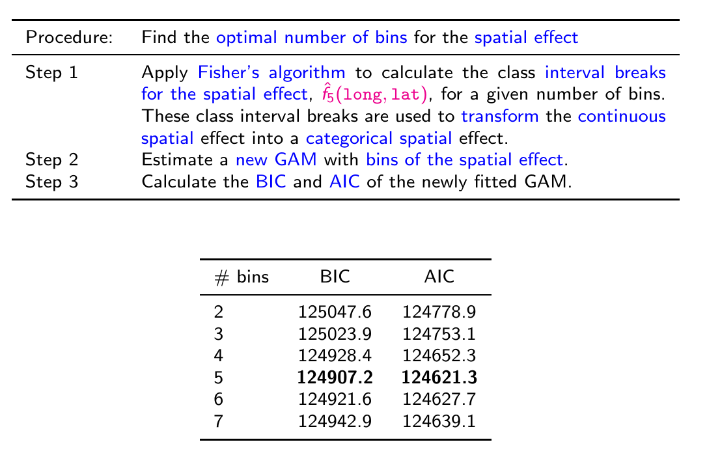

# General Structure

Recall the general structure of GAMs.

$$
f_j\left(x_j\right)=\sum_{m=1}^M \beta_{j m} b_{j m}\left(x_j\right)
$$

With a penalty function.

$$
\int\left(f_j(x)^{\prime \prime}\right)^2=\beta_j^t \mathbf{S}_j \beta_j
$$

So we balance goodness of fit and overfitting with a smoothing parameter.

$$
\log \mathcal{L}\left(\beta, \beta_j\right)-\lambda_j \cdot \beta_j^t \mathbf{S}_j \beta_j
$$\

# Two-Dimensional Thin Plate Splines

$$
f_j\left(x_j,y_j\right)=\sum_{m=1}^M \gamma_{j m} b_{j m}\left(x_j,y_j\right)
$$

With an analogous penalty function.

$$
\iint\left(\frac{\partial^2 f_j}{(\partial x)^2}\right)^2+2\left(\frac{\partial^2 f_j}{\partial x \partial y}\right)^2+\left(\frac{\partial^2 f_j}{(\partial y)^2}\right)^2 d x d y 
=\gamma_j^t \boldsymbol{T}_j \gamma_j
$$

```{r setup, include=FALSE}
knitr::opts_chunk$set(echo = FALSE)
library(magrittr)
library(tidyverse)
library(gridExtra)
library(mgcv)

# colors for the paper
KULbg <- "#116E8A"
```

```{r data-import}

mtpl_orig <- read.table('./scripts/data/P&Cdata.txt', header = TRUE)
mtpl_orig <- dplyr::as_tibble(mtpl_orig)

mtpl <- mtpl_orig |>
    dplyr::rename_all(function(.name) {
        .name %>% tolower}
        )
mtpl <- dplyr::rename(mtpl, expo = exp)
```

# Binning the Spatial Effect

Data per post-code centroid.

Our goal is to construct **homogeneous** bins.

```{r map_data}
library(sf)
library(tmap)
library(ggplot2)

belgium_shape_sf <- st_read('./scripts/shape file Belgie postcodes/npc96_region_Project1.shp', quiet = TRUE)
# belgium_shape_sf <- st_transform(belgium_shape_sf, crs = st_crs("+proj=longlat +datum=WGS84"))

simple_shp <- st_simplify(belgium_shape_sf, 
                          dTolerance = 10)
belgium_shape_sf <- st_transform(simple_shp, crs = st_crs("+proj=longlat +datum=WGS84"))

tmap_options(check.and.fix = TRUE)

tm_shape(belgium_shape_sf) +
  tm_borders(col = KULbg, lwd = 0.5) +
  tm_layout(main.title = 'Belgian Post Codes', legend.outside = TRUE, frame = TRUE) 
```

## Fitting the Spatial Effect

Fit the 2-dimensional thin-plate spline.

```{r freq_gam_spatial, echo=TRUE}

freq_gam_spatial <- gam(nclaims ~ s(long, lat, bs = "tp"), 
                        offset = log(expo), 
                        family = poisson(link = "log"), 
                        data = mtpl)
```

```{r gam_plot_spatial}

plot(freq_gam_spatial, scheme = 2)
```

```{r geoms}

post_dt <- st_centroid(belgium_shape_sf)
post_dt$long <- do.call(rbind, post_dt$geometry)[,1]
post_dt$lat <- do.call(rbind, post_dt$geometry)[,2]
```

```{r pred_spatial_effect, echo=TRUE}

pred <- predict(freq_gam_spatial, newdata = post_dt, 
                type = "terms", terms = "s(long,lat)")
```

```{r pred_shape_file}
dt_pred <- data.frame(pc = post_dt$POSTCODE, 
                      long = post_dt$long, 
                      lat = post_dt$lat, pred)
names(dt_pred)[4] <- "fit_spatial"

belgium_shape_sf <- left_join(belgium_shape_sf, 
                              dt_pred, 
                              by = c("POSTCODE" = "pc"))
```

Predict the Claims Frequency per Post Code

```{r spat_fit}

tm_shape(belgium_shape_sf) + 
  tm_borders(col = 'white', lwd = .1) + 
  tm_fill("fit_spatial", style = "cont", 
          palette = "RdBu", legend.reverse = TRUE, midpoint = NA) + 
  tm_layout(legend.title.size = 1.0, 
            legend.text.size = 1.0)
```

Recall the "best" Frequency Model.

$$
\begin{aligned}
\log (E(\text { nclaims }))= & \log (\text { exp })+\beta_0+\beta_1 \text { coverage }_{P O}+\beta_2 \text { coverage }_{F O}+\beta_3 \text { fuel }_{\text {diesel }}+ \\
& \left.\left.f_1(\text { ageph })+f_2 \text { (power }\right)+f_3(\text { bm })+f_4 \text { (ageph, power }\right)+f_5(\text { long, lat })
\end{aligned}
$$

```{r freq_gam, echo=TRUE}

freq_gam <- gam(nclaims  ~  
                  coverage + fuel + 
                  s(ageph) + s(bm) + 
                  s(power) + s(long, lat) +
                  ti(ageph, power, bs = "tp"), 
                  offset = log(expo), 
                  data = mtpl, 
                  family = poisson(link = "log"))

```

Now that we've fit the multivariate model we can predict the spatial effect for the areal data.

$$
s_i:=\hat{f}\left(\text { long }_i, \text { lat }_i\right), i=1,\dots,m
$$

```{r pred_gam}

post_dt$coverage <- mtpl$coverage[1]
post_dt$fuel <- mtpl$fuel[1]
post_dt[c("bm", "ageph", "power", "expo")] <- 
  c(mtpl$bm[1], mtpl$ageph[1], mtpl$power[1], mtpl$expo[1])

pred <- predict(freq_gam, newdata = post_dt, 
                type = "terms", terms = "s(long,lat)")

dt_pred <- tibble(pc = post_dt$POSTCODE, 
                      long = post_dt$long, 
                      lat = post_dt$lat, pred)
names(dt_pred)[4] <- "fit_spatial"
dt_pred <- dplyr::arrange(dt_pred, pc)

```

How to create the bins is dependent on your purpose. See this discussion for a good outline:

<https://geographicdata.science/book/notebooks/05_choropleth.html>

<https://r.geocompx.org/>

This paper finds the **Fisher-Jenks** algorithm "best". This is approximately K means clustering.

Minimize the sum of squared distances between the observation and the bin mean. K is a hyper-parameter.

$$
\sum_{l=1}^K \sum_{u=1}^{n_l}\left(s_u^{(l)}-\bar{s}^{(l)}\right)^2
$$

```{r fish_jenks}

library(classInt)
num_bins <- 5
classint_fisher <- classIntervals(
                      dt_pred$fit_spatial, 
                      num_bins, 
                      style = "fisher")
```



```{r}

belgium_shape_sf <- belgium_shape_sf %>% dplyr::select(-fit_spatial)
```

```{r}

belgium_shape_sf <- left_join(belgium_shape_sf, dt_pred, by = c("POSTCODE" = "pc"))
belgium_shape_sf$class_fisher <- cut(belgium_shape_sf$fit_spatial, 
      breaks = classint_fisher$brks, 
      right = FALSE, include.lowest = TRUE, 
      dig.lab = 2)
```

```{r joint_freq_plot_01, fig.width = 8, fig.height = 12}

plot1 <- ggplot(belgium_shape_sf) +
  geom_sf(aes(fill = fit_spatial), colour = NA) +
  ggtitle("MTPL claim frequency data") +
  scale_fill_gradient(low = "#99CCFF", 
                      high = "#003366") +
  theme_bw()

plot2 <- ggplot(belgium_shape_sf) + theme_bw() + 
  labs(fill = "Fisher") +
  geom_sf(aes(fill = class_fisher), colour = NA) +
  ggtitle("MTPL claim frequency data - Binned") +
  scale_fill_brewer(palette = "Blues", 
                    na.value = "white") +
  theme_bw()

gridExtra::grid.arrange(plot1, plot2)
```

# Incorporating Credibility

It would be relatively straight-forward to incorporate a credibility measure where higher credibility data available is available.

$$
\nu\hat{f}_{\text{company}}\left(\text { long }_i, \text { lat }_i\right) + \left(1-\nu\right)\hat{f}_{\text{industry}}\left(\text { long }_i, \text { lat }_i\right), i=1,\dots,m
$$

```{r sum_postcode_exposure}

post_expo <- mtpl %>% group_by(pc) %>% summarize(num = n(), total_expo = sum(expo))
```

```{r missing_freq}

miss_pc <- dplyr::left_join(belgium_shape_sf, 
                              post_expo, 
                              by = c("POSTCODE" = "pc"))
miss_pc$freq <- 
  miss_pc$total_expo/miss_pc$Shape_Area
miss_pc$freq_class <- cut(miss_pc$freq, breaks = quantile(
    miss_pc$freq, c(0,0.2,0.8,1), na.rm = TRUE),
    right = FALSE, include.lowest = TRUE, 
    labels = c("low", "average", "high"))
```

```{r freq_class_map, eval=FALSE, include=FALSE}

tm_shape(miss_pc) + 
  tm_borders(col = "black") + 
  tm_fill(col = "freq_class", 
          style = "cont", palette = "RdBu", legend.reverse = TRUE,
          colorNA = "grey")
```

Consider the fitted territory bins versus relative exposure by post code.

```{r exposure_class}

miss_pc$expo_class <- cut(miss_pc$total_expo, breaks = quantile(
    miss_pc$total_expo, c(0,0.2,0.8,1), na.rm = TRUE),
    right = FALSE, include.lowest = TRUE, 
    labels = c("low", "average", "high"))
```

```{r joint_freq_plot_02, fig.width = 8, fig.height = 12}


plot3 <- ggplot(miss_pc) +
  geom_sf(aes(fill = expo_class), 
          colour = "black", size = 0.1) +
  ggtitle("Relative Exposure by Post Code") + 
  labs(fill = "Relative\nexposure") +
  scale_fill_brewer(palette = "Blues", 
                    na.value = "pink") + 
  theme_bw()


#plot3 <- tm_shape(miss_pc) + 
#  tm_borders(col = "black") + 
#  tm_fill(col = "expo_class", 
#          style = "cont", palette = "RdBu", legend.reverse = TRUE,
#          colorNA = "grey")

plot4 <- ggplot(belgium_shape_sf) + theme_bw() + 
  labs(fill = "Fisher") +
  geom_sf(aes(fill = class_fisher), colour = NA) +
  ggtitle("MTPL claim frequency data - Binned") +
  scale_fill_brewer(palette = "Blues", 
                    na.value = "white") +
  theme_bw()

# plot4 <- tm_shape(belgium_shape_sf) + 
#  tm_borders(col = 'white', lwd = .1) + 
#  tm_fill("fit_spatial", style = "cont", 
#          palette = "RdBu", legend.reverse = TRUE, midpoint = NA) + 
#  tm_layout(legend.title.size = 1.0, 
#            legend.text.size = 1.0)

gridExtra::grid.arrange(plot3, plot4)
```
